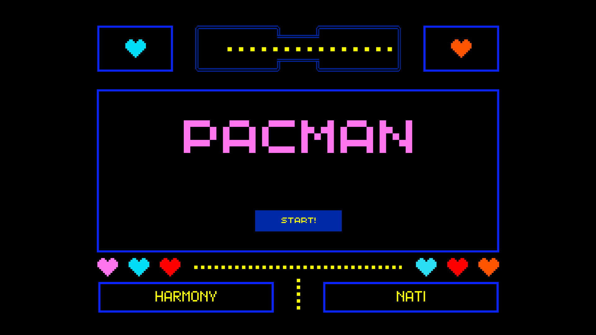
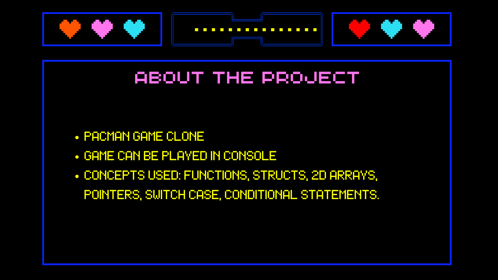
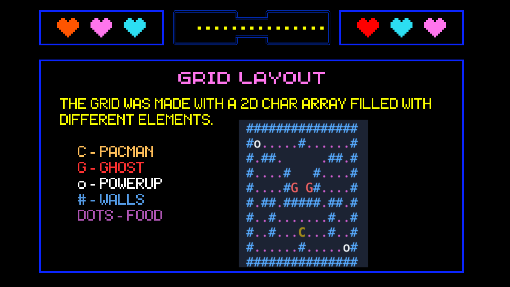
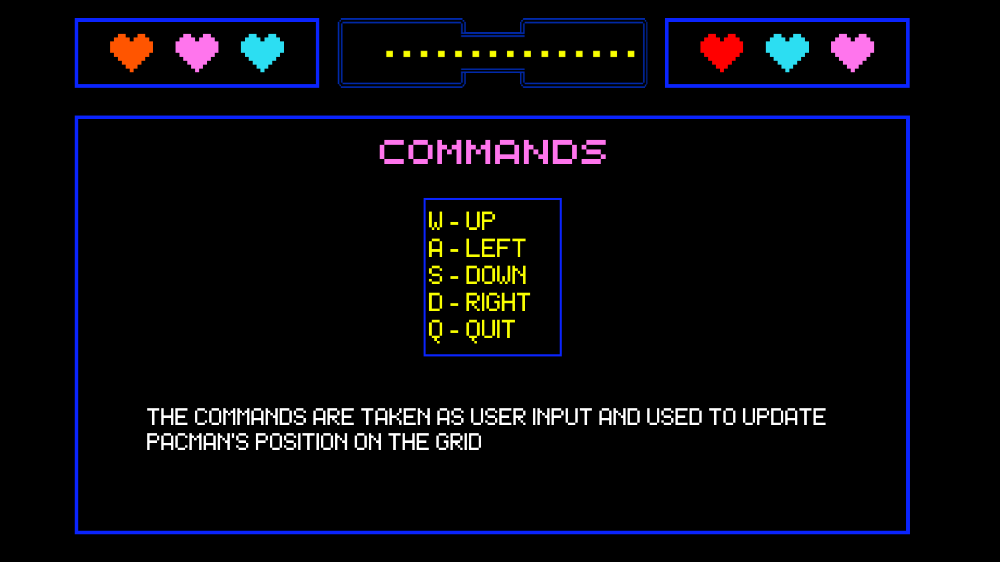
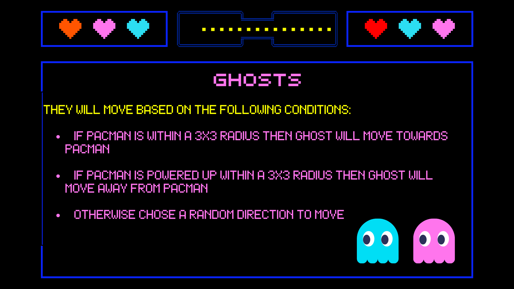
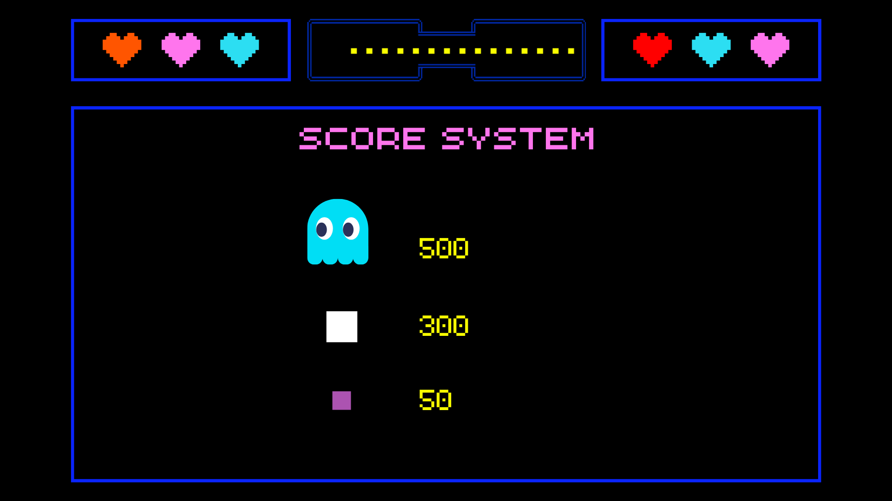
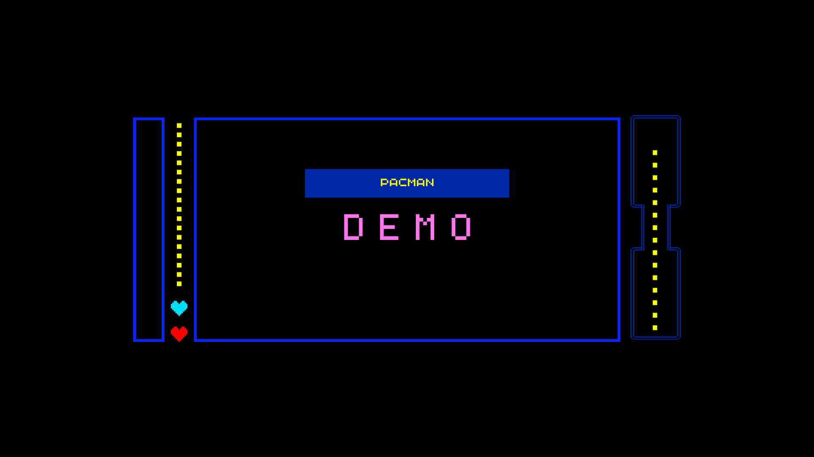
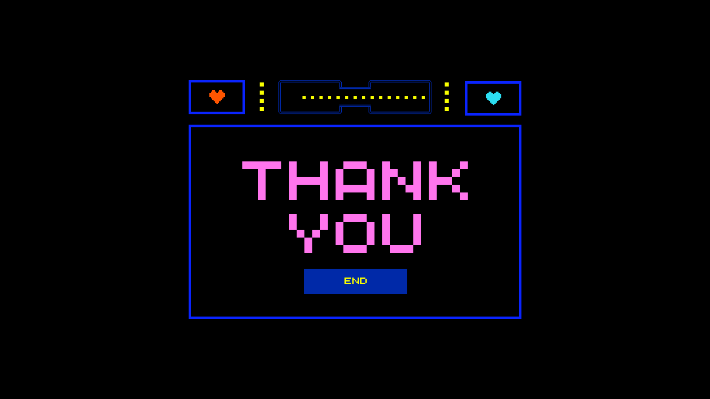

# PacMan Game in C

## Team Members

| Name              | GitHub                                                      | 
| ----------------- | ----------------------------------------------------------- | 
| Nathalia Negron-Martinez    | [@dxvinelight](https://github.com/dxvinelight)  |
| Harmony Hamilton   | [@HarmonyH27](https://github.com/HarmonyH27)  |

### Mentor

| Name              | GitHub                                                      |   
| ----------------- | ----------------------------------------------------------- |  
| Sam Sanchez Juarez  | [@samsannchez](https://github.com/samsannchez)       |          

## Demo
[Click here to see our demo!]([https://replit.com/@sa830042/PacMan-Game](https://cf5b0151-823b-4e63-81b3-d4c4d48d79dc-00-473v5sm7rpbu.spock.replit.dev/))

## About 

